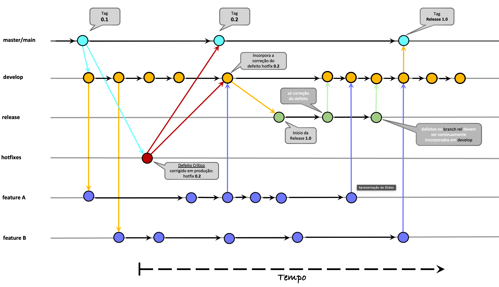

# Guia de Contribuição

Obrigado por considerar contribuir com o projeto **mvc-biblioteca**! Este documento descreve as diretrizes para contribuir de forma eficaz e segura.

---

## ✅ Regras de Proteção de Branch
Antes de contribuir, esteja ciente das regras aplicadas à branch `main`:

- **Pull Requests** são obrigatórios.
- Revisões e aprovações são exigidas.
- Apenas **Code Owners** podem aprovar.
- Testes automatizados devem passar (`roda-testes-lint`).
- Commits devem ser **assinados**.
- Push direto e bypass das regras são **proibidos**.

---

## ✅ Commits Convencionais
Utilizamos o padrão [Conventional Commits](https://www.conventionalcommits.org/pt-br/v1.0.0/#especifica%C3%A7%C3%A3o) para manter um histórico de mudanças claro e automatizar processos de versionamento.

**Exemplos práticos:**
```text
feat: adiciona funcionalidade de login
feat(auth): implementa autenticação via OAuth
fix: corrigi erro de validação de formulário
fix(api): corrigi endpoint de busca
refactor: reorganiza estrutura de pastas
refactor(core): melhora legibilidade do código
perf: otimiza consulta ao banco de dados
test: adiciona testes unitários para módulo de autenticação
build: atualiza dependências do projeto
ci: ajusta pipeline para rodar testes
chore: atualiza versão do Node.js
docs: atualiza documentação do README
revert: desfaz commit que adicionou funcionalidade X
```

> **Dica:** Sempre utilize um escopo entre parênteses quando possível, para indicar a área afetada (ex.: `feat(auth): ...`).

---

## ✅ Fluxo de Trabalho com GitHub Flow
Adotamos o [GitHub Flow](https://docs.github.com/pt/get-started/using-github/github-flow) como modelo de desenvolvimento:

1. Crie uma branch a partir da `main`.
2. Faça commits seguindo o padrão convencional.
3. Abra um Pull Request.
4. Aguarde revisões e aprovação.
5. Após aprovação e testes passarem, faça o merge.

### 🔍 Exemplo do GitHub Flow
```bash
# 1. Atualize a branch principal
git checkout main
git pull origin main

# 2. Crie uma nova branch para sua funcionalidade
git checkout -b feat/login-form

# 3. Faça alterações no código e adicione os arquivos modificados
git add .

# 4. Crie commits seguindo o padrão convencional
git commit -m "feat: adicionar formulário de login"

# 5. Envie sua branch para o repositório remoto
git push origin feat/login-form

# 6. Abra um Pull Request no GitHub
# (Descreva claramente as mudanças e relacione issues, se houver)

# 7. Após aprovação e testes passarem, faça o merge via interface do GitHub
# Nunca faça merge via push direto!
```

> **Dica:** Mantenha branches pequenas e focadas em uma única funcionalidade ou correção.

---

## ✅ Fluxo de Trabalho com GitFlow
O [GitFlow](https://git-flow.sh/) é um modelo de branching clássico que organiza o desenvolvimento em torno de branches principais e branches de suporte. Ele é ideal para projetos com ciclos de release bem definidos.

### Estrutura de Branches
- **main**: código de produção.
- **develop**: código para próxima versão.
- **feature/**: novas funcionalidades.
- **release/**: preparação para uma nova versão.
- **hotfix/**: correções urgentes em produção.

### Inicialização do GitFlow
```bash
# Instale a ferramenta disponível em:
[https://github.com/gittower/git-flow-next](https://github.com/gittower/git-flow-next)

# Inicialize o GitFlow no repositório
git flow init --preset=classic --defaults
```

### Criando uma Feature
```bash
# Crie uma branch de feature
git flow feature start login-form

# Faça alterações, commits e push
git add .
git commit -m "feat: implementar formulário de login"
git push origin feature/login-form
```

### Finalizando a Feature
```bash
# Finalize a feature (merge na develop)
git flow feature finish login-form
```

### Criando uma Release
```bash
# Crie uma branch de release
git flow release start v1.0.0

# Ajuste versão, faça commits e finalize
git flow release finish v1.0.0
```

### Criando um Hotfix
```bash
# Crie uma branch de hotfix
git flow hotfix start corrigir-bug

# Corrija, commit e finalize
git flow hotfix finish corrigir-bug
```

> **Dica:** Use `--push` para enviar automaticamente as alterações após finalizar uma branch:
```bash
git flow feature finish login-form --push
```
### Diagrama Ilustrativo do GitFlow


---

## ✅ Boas Práticas
- Mantenha o código limpo e bem documentado.
- Escreva testes sempre que possível.
- Revise cuidadosamente antes de abrir um PR.
- Utilize mensagens de commit claras e descritivas.
- Evite commits grandes; prefira mudanças pequenas e incrementais.

---

Agradecemos sua colaboração! 💙
